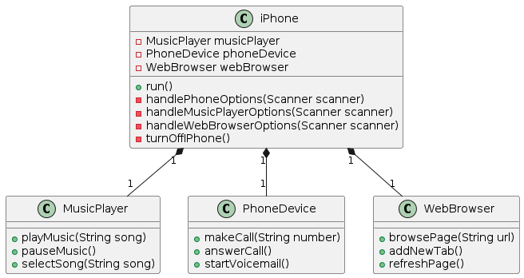

# iPhone Simulator

## Overview

This project is a simulation of the iPhone's main functionalities, including the Phone, Music Player, and Web Browser components. The goal is to provide an interactive command-line interface for users to interact with the simulated iPhone.

## UML Class Diagram

The following diagram represents the structure of the iPhone Simulator project:

## Project Structure

The project is organized as follows:

- `iPhone.java`: The main class that handles the user interface and orchestrates the interactions between the components.
- `MusicPlayer.java`: Implements the functionality of the music player component.
- `PhoneDevice.java`: Implements the functionality of the phone device component.
- `WebBrowser.java`: Implements the functionality of the web browser component.
- `AppTest.java`: Contains the test cases for the project.

## How to Run

1. Make sure you have Java 11 or higher installed on your system.
2. Clone the repository: `git clone https://github.com/your-username/dio-iphone.git`
3. Navigate to the project directory: `cd dio-iphone`
4. Compile and run the project: `javac *.java && java Main`

## Contributing

Contributions are welcome! If you find any issues or have suggestions for improvements, feel free to open an issue or submit a pull request.

## License

This project is licensed under the [MIT License](LICENSE).
